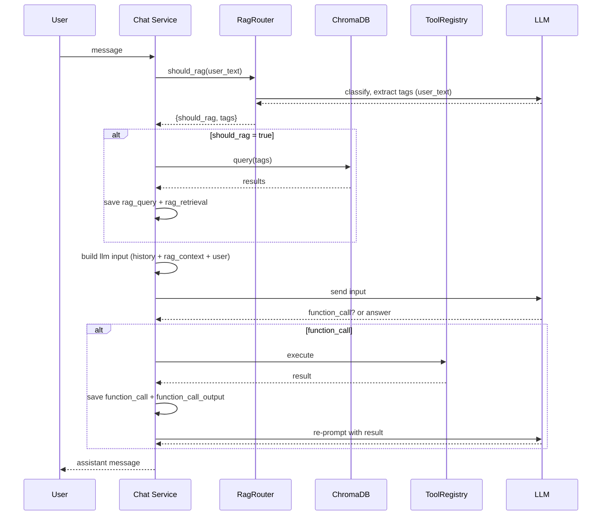

# DavaX - Smart Librarian – LLM + RAG Chat

Smart Librarian is a conversational application that combines **LLMs**, **Retrieval-Augmented Generation (RAG)**, and **tool calling** to recommend and summarize books. The system uses **ChromaDB** as a vector store, a lightweight LLM based **RagRouter** to decide whether to run retrieval, and a **React frontend** that displays a rich timeline of conversation events.

---

## Project Structure
- `backend`
  - `api/` - HTTP-only concerns (DTOs, routers)
  - `application/` – Core orchestration logic (chat service, RAG pipeline, tool loop).  
  - `domain/` – Domain entities (`ConversationEvent`) and value objects (`Role`, `EventType`).  
  - `infrastructure/`- concrete adapters (OpenAI client, repos, vectorstore):
    - `llm/` – OpenAI client
    - `vectorstore/` – ChromaDB
    - `config/` – settings & environment variables  
- `frontend/` – React app 
- `docker-compose.yml` – Container orchestration for backend, and frontend.

---

## Features

- **Conversation Event Log**  
  Every user/assistant/tool/RAG action is persisted as a `ConversationEvent`.  

- **RAG Pipeline with Router**  
  - Uses a dedicated **RagRouter** (LLM + system prompt) to decide if retrieval should run.  
  - If `should_rag=true`, runs Chroma search with OpenAI embeddings:  
    - `rag_query` (what was asked)  
    - `rag_retrieval` (retrieved candidates)  

- **Tool Loop Orchestration**  
  - Supports multiple tool calls per turn (loop until resolved or max steps reached). 

- **Rich Chat Events Timeline**  
  - `message_text` → text messages.  
  - `rag_query` → shows retrieval query.  
  - `rag_retrieval` → shows top-k.  
  - `function_call` → compact row.  
  - `function_call_output` → compact row.  

- **Containerized**  
  - Docker Compose runs backend + frontend.  

---

## Getting Started

### Prerequisites
- Python 3.10+
- Node 18+
- Docker & Docker Compose

### 1. Clone & Install
```bash
git clone <repo-url>
```

Backend deps:
```bash
cd py-api
pip install -r "requirements.txt"
```

Frontend deps:
```bash
cd chat-frontend
npm install
```

### 2. Environment
Create `.env` in backend root `py-api/`:

```env
#only api key is required, check py-api/infastrucutre/config/settings.py to see all variables
OPENAI_API_KEY=sk-...
```

### 3. Build RAG Index
Automatic on app startup

Manual:
```bash
python -m infrastructure.vectorstore.index_worker.run_sync
```

### 4. Run Local
Run the backend from python api root directory `/py-api`:
```sh
python -m uvicorn main:app --port 8000
```
Run the frontend from react app root directory `/chat-frontend`:
```sh
npm run dev
``` 
### 5. Run Containers
```bash
docker-compose up 
```

This starts:
- Backend FastAPI
- Frontend React app (`localhost:3000`)

---

## Retrieval Flow

### Step-by-step

1. **User message** → `message_text(user)` event.  
2. **RagRouter** decides:
   ```json
   {"should_rag": true, "tags": ["friendship","magic"]}
   ```
3. If yes:
   -  query db 
   - `rag_query` save (with tags → query).  
   - `rag_retrieval` save (Chroma search results).  
4. **LLM input** is built with chat hisotry+ retrieval context + user msg.  
5. Model may:
   - Respond directly (assistant message).  
   - Emit `function_call` (e.g. get_summary_by_title).  
6. Tool loop runs:
   - `function_call` saved.  
   - Execute function → `function_call_output`.  
   - Re-ask model with results until final answer, or max steps is reached.  
7. **Assistant message** saved and returned.  

---

## Sequence Diagram



---

## Frontend

### Event Bubbles
- **MessageBubble** → user/assistant text  
- **ToolCall** → shows tool invoked, hover to expand args  
- **ToolResult** → shows tool output, hover to expand JSON  
- **RAGQuery** → shows retrieval query
- **RAGRetrieval** → shows top-k titles, hover for scores/snippets  

Each uses the `useHoverDisclosure` + `HoverPanel` for single-row previews with expandable panels.

---

## Notes

### Chat Events as Single Source of Truth
- Every interaction (user/assistant messages, RAG queries, retrievals, tool calls/results) is stored as a `ConversationEvent`.
- Each event has: `role`, `event_type`, `payload`, and a timestamp.
- Events act as the **single source of truth**.
- From the same data you can build different projections:
  - **LLM input view** (compact, sanitized context for prompts),
  - **Frontend view**,
- Advantage: no duplication of logic; multiple consumers can use the same event log.

### Event Mapper
- Event → Input mapping is handled by a **registry of mappers** (functions keyed by `event_type`).
- Mappers convert stored events into:
  - OpenAI Responses API input blocks (for LLMs)
- Extensible: new event types only need a mapper.

### LLM Abstraction (Partial)
- The backend attempts to abstract the underlying LLM provider/api
- Althow some parts remain **tightly coupled**:
  - **Tool loop** logic assumes OpenAI’s schema (`function_call`, `function_call_output`).

### Custom Tool Registry
- Tools managed via a `ToolsRegistry`.
- Backed by a custom **`LLMFunction` class**:
  - Wraps a Python handler function,
  - Enforces argument validation with `Param` dataclasses,
  - Supports defaults, required flags, type coercion,
  - Exposes JSON-schema style parameter specs.
- Example:
  ```python
  def get_summary_by_title(title: str): ...
  fn = LLMFunction(
      name="get_summary_by_title",
      description="Return the summary for a book",
      handler=get_summary_by_title,
      params=[Param("title", str, "Book title")]
  )
  registry.register(fn)
  ```
---

### RAG Indexing & Diff
- Uses **ChromaDB** as vector store.
- Startup indexer (`indexer_worker.py`):
  - Computes hash per record (`title+summary+tags`),
  - Compares with manifest,
  - **Upserts** changed/new docs,
  - **Deletes** removed docs.
- Efficient: only re-embeds what changed.

---

### Embeddings Choice
- Tried HuggingFace `SentenceTransformerEmbeddingFunction`:
  - Worked locally but unstable (sometimes failed init).
- Fallback: **OpenAI embeddings** (`text-embedding-3-small`).
- Tradeoff: reliable, but requires API key & quota.

---